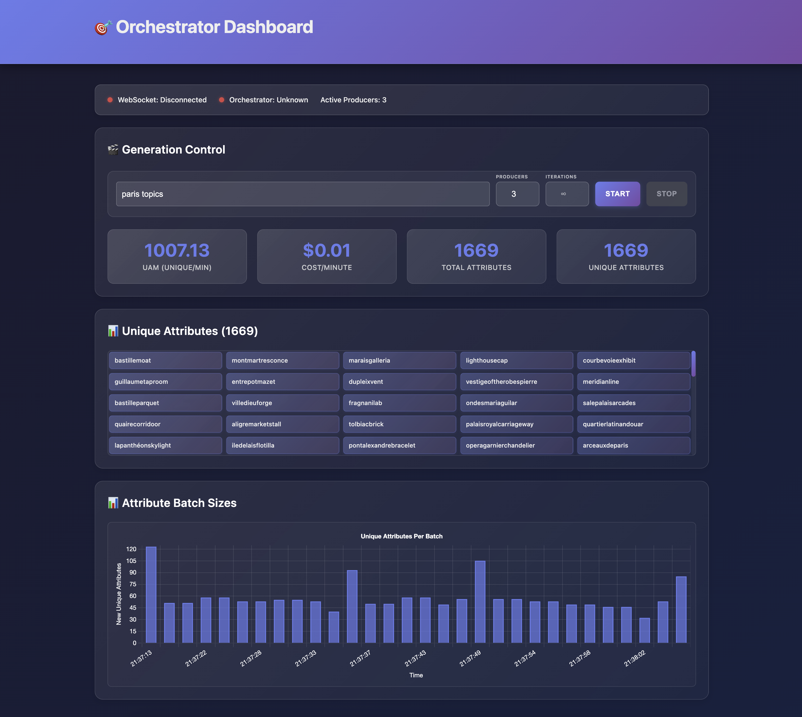

# igentai Concurrent LLM Orchestration System

## Technical Documentation

### Table of Contents

1. [System Architecture](#system-architecture)
2. [Component Functionality](#component-functionality)
3. [System Operation](#system-operation)
4. [Testing Methodology](#testing-methodology)
5. [Web Dashboard Interface](#web-dashboard-interface)
6. [Future Extensions](#future-extensions)

---

## System Architecture

The igentai system is a distributed Rust application designed for concurrent LLM orchestration to explore topics and generate unique attributes. The architecture follows a clean separation of concerns with dependency injection for testability, creating a foundation for distributed AI coordination.

The system's distributed nature allows it to coordinate multiple Large Language Model providers simultaneously, creating an approach to content generation that leverages the capabilities of multiple providers. This orchestration methodology enables comprehensive topic exploration while maintaining deduplication controls and cost optimization strategies.

```
                    ┌─────────────┐
                    │  LLM APIs   │
                    │ OpenAI      │
                    │ Anthropic   │
                    │ Gemini      │
                    │ Random      │
                    └─────┬───────┘
                          │
    ┌─────────────────────▼───────────────────────┐
    │             PRODUCER LAYER                  │
    │  ┌─────────┐  ┌─────────┐  ┌─────────┐     │
    │  │Producer1│  │Producer2│  │(Process)│     │
    │  │(Process)│  │(Process)│  │ProducerN│     │
    │  └────┬────┘  └────┬────┘  └────┬────┘     │
    └───────┼────────────┼────────────┼──────────┘
            │            │            │
            │      IPC Communication  │
            │   (TCP Sockets + JSON)  │
            │            │            │
    ┌───────▼────────────▼────────────▼──────────┐
    │          ORCHESTRATOR CORE                 │
    │  ┌─────────────────────────────────────┐   │
    │  │        Core Components              │   │
    │  │  • State Management                 │   │
    │  │  • UniquenessTracker (Bloom Filter)│   │  
    │  │  • PerformanceTracker               │   │
    │  │  • Optimizer (AI Routing)          │   │
    │  │  • Process Manager                  │   │
    │  └─────────────────────────────────────┘   │
    └───────┬────────────────────────────────────┘
            │ WebSocket + HTTP API
            │
    ┌───────▼───────┐              ┌─────────────┐
    │   WEBSERVER   │              │   TESTER    │
    │   • Dashboard │              │ E2E Testing │
    │   • WebSocket │              │ Distributed │
    │   • REST API  │              │ Tracing     │
    │   • Static UI │              │ Validation  │
    └───────────────┘              └─────────────┘
```

The architectural foundation consists of four primary layers working together to deliver content generation capabilities. The system consists of an Orchestrator that serves as central coordinator managing producer processes and deduplicating results, Producers as individual processes calling LLM APIs to generate attributes, a WebServer providing real-time web interface for metrics and control, and a Tester implementing end-to-end testing framework using distributed tracing for validation.

---

## Component Functionality

### 1. Orchestrator Core (`orchestrator/`)

The orchestrator functions as the central coordinator that manages all system operations. This component serves as the system's intelligence hub, coordinating distributed operations across multiple processes while maintaining consistency and optimization objectives.

The orchestrator's responsibilities encompass process management through spawning and monitoring producer and webserver processes, state coordination that maintains system-wide state and synchronization, uniqueness tracking using Bloom filters to eliminate duplicate attributes across producers, performance monitoring that tracks UAM (Unique Attributes per Minute), cost, efficiency metrics, and optimization that routes requests and adjusts strategies based on performance data.

**Core Components:**

#### State Management (`core/state.rs`)

The state management system serves as the foundational component that maintains comprehensive system state including centralized state store with generation context, producer lifecycle tracking, CLI iteration management with detailed cycle statistics, and performance metrics aggregation. This component ensures all system operations maintain consistency while providing the data foundation for decision-making processes.

#### Uniqueness Tracker (`core/uniqueness.rs`)

The uniqueness tracking system implements a Bloom filter for memory-efficient deduplication, supports distribution of filter state to producers to maintain global consistency, and tracks iteration-specific attributes for detailed reporting and analysis. This system ensures that the distributed generation process maintains uniqueness guarantees across all producers.

#### Performance Tracker (`core/performance.rs`)

This component provides real-time performance metrics calculation across multiple dimensions, implements per-provider cost tracking with token usage analysis, calculates UAM, cost-per-minute, uniqueness ratio measurements, and performs provider comparison and trend analysis to guide optimization decisions.

#### Optimizer (`optimization/`)

The optimization system employs a trait-based dependency injection architecture that enables flexible strategy selection and testing. The system provides two primary optimizer implementations: Basic and Adaptive strategies, each designed for different use cases and operational requirements.

**Architecture Design**

The optimizer follows clean architectural principles with separation of concerns across multiple modules:

- `traits.rs` - Contains the core `OptimizerStrategy` trait defining the interface
- `types.rs` - Shared data structures for optimization context and results
- `strategies/` - Individual optimizer implementations (Basic, Adaptive)

The `OptimizerStrategy` trait provides four essential methods: `optimize()` for generating recommendations, `update_performance()` for learning from feedback, `reset()` for session initialization, and `get_state()` for monitoring and debugging.

**Basic Optimizer (`strategies/basic.rs`)**

The Basic optimizer provides a completely stateless, functional approach to optimization. It generates consistent, reliable prompts and routing strategies without complex adaptation logic. This optimizer is ideal for stable production environments where predictable behavior is prioritized over advanced optimization.

Key characteristics include:

- Stateless operation with identical outputs for identical inputs
- Simple, reliable prompt generation focused on concrete nouns and components
- Straightforward routing strategy selection based on available providers
- No performance learning or adaptation capabilities
- Minimal risk factors and immediate effectiveness

**Adaptive Optimizer (`strategies/adaptive.rs`)**

The Adaptive optimizer implements sophisticated learning capabilities with prompt rotation, UAM decline detection, and performance-based adaptation. It uses interior mutability through `RwLock` to maintain state while preserving the clean read-only interface.

Sophisticated features include:

- UAM trend analysis with configurable decline thresholds
- Dynamic prompt template rotation based on performance patterns
- Producer-specific prompt assignments for optimization experiments
- Performance history tracking with sliding window analysis
- Adaptation level scaling (None, Minimal, Moderate, Aggressive)
- Temperature and request size adjustments based on performance trends

The adaptive system monitors UAM performance over time and triggers adaptation when decline exceeds configured thresholds, automatically rotating between different prompt strategies to maximize unique attribute generation.

### 2. Producer (`producer/`)

Each producer operates as an individual process that interfaces with LLM APIs to generate attributes while maintaining coordination with the central orchestrator. These processes serve as the execution engine of the distributed system.

The producer's key responsibilities include API integration that communicates with multiple LLM providers, attribute processing that extracts and validates attributes from responses, deduplication through maintaining local bloom filter sync with orchestrator, and performance reporting that tracks request metrics and success rates.

**Core Components:**

#### API Client (`services/api_client.rs`)

This component implements multi-provider support covering OpenAI, Anthropic, Gemini, and Random providers. It handles request/response processing with retry logic, extracts token usage and performs cost calculation, and implements rate limiting and error handling to ensure reliable operation across all supported providers.

#### Attribute Processor (`core/processor.rs`)

The processor handles text parsing and attribute extraction from provider responses, performs local deduplication using synchronized bloom filters that maintain consistency with the global uniqueness state, and validates responses with proper formatting to ensure output quality consistency.

#### Command Generator (`core/generator.rs`)

This component provides test mode simulation capabilities for development and testing, implements command scheduling with configurable intervals to optimize request timing, and handles provider selection based on routing strategy decisions from the orchestrator.

### 3. WebServer (`webserver/`)

The webserver provides a real-time web interface for monitoring and control, transforming complex system operations into intuitive, actionable insights through modern web technologies.

The webserver's responsibilities encompass providing a modern dashboard UI for system monitoring, implementing WebSocket communication for real-time updates to connected clients, offering REST API endpoints for system control, and serving static files for the dashboard application.

**Core Components:**

#### WebSocket Manager (`services/websocket_manager.rs`)

This component implements real-time bidirectional communication capabilities, manages client session state and lifecycle, and provides message routing and broadcasting to ensure all connected clients receive relevant updates without overwhelming network resources.

#### State Management (`core/state.rs`)

The webserver's state management handles system health monitoring across all components, generates analytics insights based on system performance data, and provides performance optimization recommendations to help users maximize system effectiveness.

### 4. Tester (`tester/`)

The tester implements a comprehensive end-to-end testing framework using distributed tracing, representing an approach to distributed system validation that goes beyond traditional unit testing methodologies.

The tester's responsibilities include service constellation management that orchestrates distributed testing scenarios, tracing-based validation that uses distributed tracing instead of mocks for verification, topic-centric testing that organizes tests around complete workflows, and real system testing that validates actual production code paths.

**Core Components:**

#### Topic Testing Framework (`testing/topic.rs`)

This serves as the main testing interface for end-to-end scenarios, provides built-in assertion methods for system validation, and enables real-world behavior verification through comprehensive distributed system interaction analysis.

#### Service Constellation (`runtime/constellation.rs`)

This component provides unified orchestrator startup management across different testing scenarios, handles process lifecycle coordination for complex distributed tests, and manages configuration for different testing modes including CLI and WebServer scenarios.

---

## System Operation

### Startup Sequence

The system operates through a carefully orchestrated sequence of phases, each building upon the previous to create a cohesive content generation platform.

**Initialization Phase**
The operational lifecycle begins with comprehensive initialization where the orchestrator loads configuration and initializes core components, performs API key validation for available providers, and completes state store initialization. This phase ensures all foundational systems are properly configured before any distributed operations commence.

**Service Spawning Phase**
Following initialization, the system enters service spawning where producer processes are spawned with unique ports for communication, the WebServer process is started if operating in web mode, and IPC communication channels are established between all components to enable coordinated operation.

**Generation Phase**
The generation phase represents the culmination of system preparation where topic initialization occurs with bloom filter setup, producer registration and health checking ensures all processes are ready for coordinated operation, and start commands are dispatched to producers to begin the generation workflow.

### Data Flow

The system implements a data flow architecture that manages information processing across multiple dimensions while maintaining consistency and performance requirements.

```
Topic Input → Orchestrator → Producers → LLM APIs
     ↑                          ↓
Performance ← State Store ← Attributes
Optimization                     ↓
     ↓                    Deduplication
WebSocket ← WebServer ← Unique Attributes
Updates                         ↓
                         File Output
```

The data flow demonstrates how topic information enters through either CLI interfaces or web-based controls, flows through the orchestrator for analysis and optimization, gets distributed to producers for processing through various LLM APIs, returns through deduplication and aggregation processes, and ultimately reaches users through both file output and real-time web interface updates.

### Communication Protocols

The system implements multiple communication protocols that enable seamless coordination across the distributed network while maintaining security, reliability, and performance objectives.

#### Orchestrator ↔ Producer (Internal IPC)

The communication between orchestrators and producers utilizes Command Messages including Start, Stop, UpdateConfig, UpdateBloomFilter, and Ping operations, along with Update Messages encompassing AttributeBatch transfers, StatusUpdate reports, SyncAck confirmations, and BloomUpdated notifications. This protocol ensures reliable coordination between the central orchestrator and distributed producers.

The `UpdateConfig` message serves as the primary mechanism for distributing optimization results to producers. When the optimizer generates new prompt assignments or parameter adjustments, these are packaged into UpdateConfig messages and sent to specific producers, enabling dynamic adaptation of generation strategies.

#### Orchestrator ↔ WebServer (Internal IPC)

The internal communication provides System Metrics with real-time performance data transfer, Control Commands for start/stop generation requests, and Status Updates covering system health and producer states to maintain comprehensive system awareness.

#### WebServer ↔ Browser (WebSocket/HTTP)

The browser communication implements Real-time Updates including attribute updates, dashboard metrics, and alerts, along with REST API endpoints at `/api/start`, `/api/stop`, and `/api/status` for programmatic system control and integration.

### Operating Modes

The system supports multiple operational modes, each optimized for specific use cases and deployment scenarios.

#### CLI Mode

CLI mode enables direct topic processing without requiring web interface through commands such as:

```bash
./orchestrator --topic "Sustainable Energy" --producers 3 --provider random --iterations 10
```

This mode provides configurable producer count and iteration limits with file-based output including performance metrics export. The mode is ideal for automated workflows, batch processing operations, and integration with existing enterprise systems.

#### WebServer Mode

WebServer mode creates an interactive web dashboard accessible at http://localhost:8080 through the simple command:

```bash
./orchestrator
```

This mode enables real-time monitoring and control with dynamic topic configuration, providing comprehensive visibility into system operations through web interfaces that support collaborative workflows.

---

## Testing Methodology

### Component-Level Testing

The system implements comprehensive component-level testing that establishes the foundation of quality assurance through multiple validation approaches.

#### Unit Testing

Unit testing employs mock-based testing for individual components, leverages the system's dependency injection architecture to enable isolated testing, and implements property-based testing for critical algorithms including bloom filters and deduplication logic. This approach ensures each component meets specifications independently while providing comprehensive coverage of normal operations, error conditions, and edge cases.

#### Integration Testing

Integration testing validates Producer API Integration through tests with real provider APIs using test keys, verifies IPC Communication by validating message passing between components, and confirms File System Integration through testing output generation and synchronization capabilities. These tests ensure components work correctly when combined while maintaining performance and reliability characteristics.

### Constellation-Level Testing (Distributed)

The tester component implements a unique distributed testing approach that tests the entire system as a constellation of services rather than relying on traditional mocking strategies.

#### Key Principles

The constellation-level testing operates on several fundamental principles. It implements Real System Testing by starting actual orchestrator, producer, and webserver processes in controlled environments. It uses Tracing-Based Validation through distributed tracing spans to validate behavior across all system components. The approach organizes tests using Topic-Centric API structure around complete end-to-end workflows that mirror real-world usage patterns.

#### Testing Framework Architecture

The testing framework provides an API that enables comprehensive distributed system validation:

```rust
// Configure test scenario
let config = OrchestratorConfig::builder()
    .topic("test_topic")
    .producers(3)
    .iterations(Some(10))
    .build();

// Start distributed system
let mut constellation = ServiceConstellation::new(trace_endpoint);
constellation.start_orchestrator(config).await?;

// Wait for completion and validate via tracing
if let Some(topic) = Topic::wait_for_topic("test_topic", collector, timeout).await {
    assert!(topic.assert_completed().await);
    assert!(topic.assert_min_attributes(20));
    assert!(topic.assert_no_errors().await);
    topic.print_summary();
}
```

This framework enables test authors to describe complete distributed workflows in understandable terms while the framework manages the complex orchestration required to execute and validate these scenarios.

#### Validation Mechanisms

**Tracing-Based Validation** provides comprehensive validation capabilities including Process Lifecycle validation that confirms orchestrator and producer startup/shutdown sequences, IPC Communication verification that ensures message passing between components works correctly, API Interactions confirmation that validates LLM API calls and responses function as expected, File Operations validation that checks output file creation and content accuracy, and Error Handling verification that ensures graceful failure recovery under various conditions.

**Benefits** of this approach include testing actual production code paths rather than simplified mock representations, validating distributed system coordination including timing relationships and resource contention, providing detailed observability into test execution for rapid issue identification, and scaling to test varying system configurations as the system evolves.

#### Test Scenarios

The constellation testing framework includes a comprehensive suite of scenarios designed to validate different aspects of the distributed system. Each scenario focuses on specific system behaviors and edge cases.

**Core Functionality Tests**

The core test suite validates fundamental system operations:

- **Basic Test**: Validates essential orchestrator and producer functionality using minimal configuration. The test uses rapid development settings and verifies that the system starts with the correct budget allocation and completes successfully within expected timeframes.

- **Load Test**: Stress tests the system with higher concurrency, utilizing 5 producers with 10 iterations each. This scenario validates system stability under load and ensures proper generation of large attribute volumes (200+). The test uses the OpenAI provider to simulate realistic API interactions.

- **Healing Test**: Validates the system's fault tolerance by simulating producer failures. Using 3 producers with 8 iterations, the test ensures the orchestrator properly handles producer crashes and recovers through automatic healing mechanisms, completing generation despite failures.

- **Single Start Test**: Addresses a critical bug prevention scenario by ensuring each producer receives exactly one Start command per topic. This test prevents duplicate initialization issues that could lead to inconsistent state or resource conflicts.

- **Trace Capture Test**: Validates the distributed tracing infrastructure by ensuring traces are properly collected from all process types (orchestrator, webserver, and producers). This test is essential for verifying observability capabilities.

- **Real API Test**: When API keys are available, this test validates integration with actual LLM providers. Using the OpenAI API with gpt-4o-mini model, it generates real content for "Paris attractions" and verifies the complete generation pipeline.

**Edge Case Tests**

Edge case scenarios ensure graceful handling of boundary conditions:

- **Minimal Test**: Validates system behavior with minimal resources using a single producer and only 2 iterations. This test ensures the system remains functional even with constrained configurations.

- **Empty Test**: Tests the system's handling of zero iterations, ensuring graceful behavior when no actual generation work is requested. This validates proper lifecycle management and prevents crashes in edge cases.

**Web Interface Tests**

- **Server Test**: Validates webserver mode startup and HTTP interface availability. The test ensures the web dashboard properly initializes and responds to HTTP requests on the configured port.

**Test Suite Organization**

The framework provides composite test suites for comprehensive validation:

- **Core Suite**: Executes all core functionality tests in sequence (basic → load → healing → single_start)
- **All Suite**: Runs the complete test battery including core tests, edge cases, and web interface validation

**Execution Commands**

Tests can be executed individually or as suites:

```bash
# Run a specific scenario
cargo run --bin tester -- --scenario basic

# Run the core test suite
cargo run --bin tester -- --scenario core

# Run all tests
cargo run --bin tester -- --scenario all

# Keep services running for debugging
cargo run --bin tester -- --keep-running

# Run with verbose tracing
cargo run --bin tester -- --scenario load --log-level debug
```

Each test produces detailed output including assertion results, performance metrics, and comprehensive trace logs for debugging purposes.

---

## Web Dashboard Interface

The web interface provides a real-time dashboard for monitoring and controlling the orchestration system, transforming complex system operations into intuitive, actionable insights through modern web technologies and visualization techniques.



### Dashboard Components

#### 1. System Status Bar

The status monitoring provides comprehensive system health visibility through WebSocket Connection indicators that show real-time connection status with animated visual feedback, Orchestrator Status monitoring for core system health assessment, and Active Producers display showing live count of working producer processes.

#### 2. Generation Control Panel

The control interface enables comprehensive system management through Topic Input with dynamic entry and validation capabilities, Producer Configuration supporting adjustable producer count from 1 to 99 instances, Iteration Control providing optional iteration limiting for budget management, and Start/Stop Controls with loading states that provide immediate feedback for all user actions.

#### 3. Performance Metrics Dashboard

Real-time metric cards provide comprehensive system analytics displaying UAM (Unique Attributes/Min) as the core productivity metric, Cost/Minute for real-time cost monitoring and budget control, Total Attributes showing cumulative generation count, and Unique Attributes displaying deduplicated unique count for quality assessment.

#### 4. Live Attribute Display

The attribute visualization creates an engaging interface through Grid Layout with responsive attribute tiles and smooth animations, Real-time Updates where new attributes appear with fade-in animations, Infinite Scroll displaying the most recent 100 attributes, and future Search/Filter capabilities for enhanced exploration.

#### 5. Diminishing Returns Visualization

Interactive Chart.js bar chart provides performance analysis showing Batch Efficiency Trends with new unique attributes per batch over time, Horizontal Scrolling that auto-scrolls to show latest data, Dynamic Scaling that adjusts to accommodate varying data volumes, and Performance Insights through visual indication of generation efficiency patterns.

### Technical Implementation

#### Frontend Architecture

The implementation demonstrates web development through Vanilla JavaScript architecture with no framework dependencies for maximum performance, WebSocket Communication providing real-time bidirectional data flow, Chart.js Integration for data visualization, and Responsive Design with mobile-first CSS and modern styling approaches.

#### Real-time Features

The interface implements capabilities including Live Updates where attributes appear as they're generated, Connection Management with automatic reconnection using exponential backoff strategies, Performance Monitoring through real-time metrics updates every few seconds, and Interactive Controls providing immediate feedback for all user actions.

#### Styling & UX

The visual design employs Modern Design Language with gradient backgrounds and glassmorphism effects, Dark Theme optimization for extended viewing sessions, Smooth Animations through CSS transitions and transform effects, and Accessibility features including proper contrast ratios and keyboard navigation support.

---

## Prompt Assignment and Optimization Flow

### Optimization Lifecycle

The optimization system operates through a carefully orchestrated lifecycle that integrates seamlessly with the broader orchestrator workflow:

**Initialization Phase**
During system startup, the orchestrator receives an optimizer instance through dependency injection. The optimizer is initialized with its configuration and any necessary state is prepared for operation.

**Periodic Optimization Cycle**
The orchestrator runs optimization evaluations at regular intervals, separate from metrics collection. This separation ensures optimization decisions are based on stable performance data rather than transient fluctuations.

**Context Assembly**
Before each optimization cycle, the orchestrator assembles an `OptimizationContext` containing:

- Current topic being explored
- Active producer IDs and their current state
- Performance metrics including UAM trends, cost data, and uniqueness ratios
- Available routing options and system defaults
- Optimization targets and constraints

**Strategy Execution**
The optimizer analyzes the context and generates an `OptimizationResult` containing:

- Prompt assignments (uniform across all producers or customized per producer)
- Routing strategy adjustments
- Generation configuration parameters (temperature, request size, etc.)
- Assessment of expected impact and confidence levels

**Result Distribution**
Optimization results are distributed to producers via `UpdateConfig` messages, which contain the new prompt text and any parameter overrides. Producers immediately adopt the new configuration for subsequent requests.

### Prompt Template System

The Adaptive optimizer employs a sophisticated prompt template system designed to maximize unique attribute generation:

**Template Categories**

- **Concrete Templates**: Focus on specific physical objects, materials, and structural components
- **Creative Templates**: Explore unconventional aspects and hidden elements of topics
- **Technical Templates**: Emphasize engineering specifications and specialized terminology
- **Functional Templates**: Target operational aspects and behavioral characteristics
- **Structural Templates**: Examine organizational and hierarchical elements
- **Contextual Templates**: Consider environmental and situational factors

**Template Performance Tracking**
Each template maintains performance metrics including usage count, cumulative UAM contribution, and last usage timestamp. This data enables the optimizer to identify high-performing templates and adjust assignment strategies accordingly.

**Dynamic Assignment Strategy**
When UAM performance declines, the adaptive optimizer distributes different templates across producers to conduct real-time A/B testing. This approach identifies the most effective prompts for the current topic and performance conditions.

### Configuration and Observability

The optimization system provides comprehensive configuration options and observability features:

**Command-Line Integration**
Optimization behavior is influenced by command-line arguments:

- `--request-size`: Controls the number of attributes requested per API call
- `--routing-strategy` and `--routing-config`: Define provider selection and load balancing
- `--trace-ep`: Enables distributed tracing for optimization decision observability
- `--log-level debug`: Provides detailed optimization decision logging

**Performance Monitoring**
Optimization decisions are logged with detailed rationale, expected impact metrics, and confidence assessments. This information supports system debugging and performance analysis.

**State Inspection**
The optimizer's `get_state()` method provides real-time visibility into:

- Active optimization strategies
- Performance history size and trends
- Current adaptation level
- Last optimization timestamp

This observability enables operators to understand optimization behavior and tune system parameters for optimal performance.

## Future Extensions

### Advanced Optimizer Strategies

**Semantic-Aware Optimizer**
- Analyzes generated attributes to build a semantic understanding of the topic space
- Identifies conceptual gaps and underexplored areas through clustering algorithms
- Dynamically adjusts prompts to target specific semantic regions
- Tracks topic coverage completeness and suggests when diminishing returns are reached

**Multi-Model Ensemble Optimizer**
- Leverages different LLM models' unique strengths for specific attribute categories
- Learns which providers excel at technical, creative, or factual content
- Implements provider-specific prompt optimization based on historical performance
- Balances exploration of new approaches with exploitation of proven strategies

**Contextual Learning Optimizer**
- Maintains a knowledge base of successful prompt patterns across different topic domains
- Applies transfer learning from similar topics to accelerate optimization
- Builds topic-specific vocabularies and terminology preferences
- Adapts generation parameters based on topic complexity and breadth

### Prompt Design Evolution

**Automated Prompt Engineering**
- Genetic algorithms for evolving prompt templates through mutation and selection
- Real-time A/B testing of prompt variations across producer pools
- Reinforcement learning to optimize prompt structures for maximum uniqueness
- Natural language analysis of successful vs unsuccessful prompt patterns

**Dynamic Prompt Composition**
- Modular prompt building blocks that can be dynamically assembled
- Context-sensitive prompt expansion based on initial generation results
- Progressive prompt refinement through iterative feedback loops
- Automatic incorporation of discovered domain terminology into subsequent prompts

**Prompt Performance Analytics**
- Detailed metrics on prompt effectiveness by category and provider
- Visualization of prompt evolution and performance trends over time
- Identification of prompt fatigue patterns and automatic rotation strategies
- Cross-topic prompt performance analysis for universal optimization insights

### Quality and Relevance Optimization

**Attribute Quality Scoring**
- Machine learning models to assess attribute relevance and quality
- Automatic filtering of low-quality or off-topic generations
- Feedback mechanisms to improve future generation quality
- Provider-specific quality calibration and adjustment

**Intelligent Deduplication**
- Semantic similarity detection beyond exact string matching
- Concept-level deduplication to maximize true uniqueness
- Hierarchical attribute organization to identify redundant categories
- Smart merging of similar attributes into refined versions
